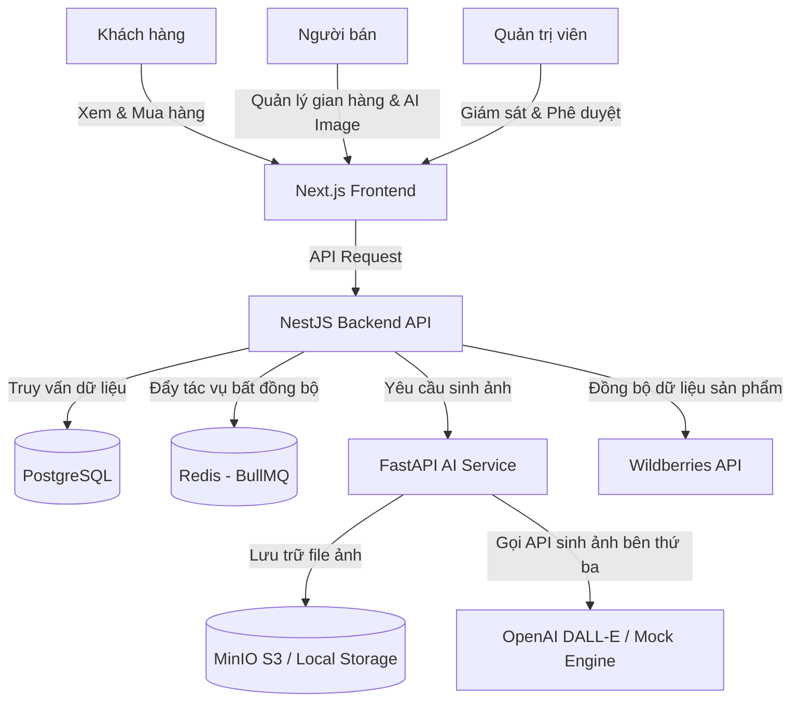

# TRƯỜNG ĐẠI HỌC CÔNG NGHỆ THÔNG TIN VÀ TRUYỀN THÔNG VIỆT - HÀN
**KHOA KHOA HỌC MÁY TÍNH**

***

# BÁO CÁO DỰ ÁN TỐT NGHIỆP

## ĐỀ TÀI: PHÁT TRIỂN HỆ THỐNG THƯƠNG MẠI ĐIỆN TỬ ĐA GIAN HÀNG TÍCH HỢP TRÍ TUỆ NHÂN TẠO (TRAWBERRY AI COMMERCE)

**Sinh viên thực hiện:** Nhóm Nghiên cứu & Phát triển Trawberry  
**Lớp:** 22KIT  
**Ngành:** Công nghệ thông tin  
**Chuyên ngành:** Công nghệ phần mềm  
**Giảng viên hướng dẫn:** Dr. Nguyễn Văn Lợi  

**_Đà Nẵng – 06/2026_**

***

# LỜI CẢM ƠN

Trước hết, chúng em xin bày tỏ lòng biết ơn chân thành sâu sắc tới Ban Giám hiệu Trường Đại học Công nghệ thông tin và Truyền thông Việt - Hàn, cùng toàn thể quý thầy cô giáo Khoa Khoa học Máy tính. Những kiến thức học thuật quý báu cùng môi trường học tập năng động, hiện đại tại nhà trường đã tạo tiền đề vững chắc cho chúng em hoàn thành dự án tốt nghiệp này.

Đặc biệt, chúng em xin gửi lời cảm ơn sâu sắc nhất tới thầy hướng dẫn, Dr. Nguyễn Văn Lợi, vì sự tận tâm chỉ bảo, định hướng khoa học và hỗ trợ kịp thời trong suốt quá trình nghiên cứu và triển khai dự án **"Phát triển hệ thống thương mại điện tử đa gian hàng tích hợp trí tuệ nhân tạo (Trawberry AI Commerce)"**. Những ý kiến đóng góp mang tính xây dựng cùng sự động viên của thầy đã giúp chúng em vượt qua nhiều thách thức kỹ thuật và hoàn thành sản phẩm đúng tiến độ.

Chúng em cũng xin cảm ơn gia đình, bạn bè và tập thể lớp 22KIT đã luôn đồng hành, động viên và đưa ra những lời khuyên hữu ích để dự án được hoàn thiện tốt nhất.

Dù đã nỗ lực hết mình, dự án khó tránh khỏi một số hạn chế do giới hạn về mặt thời gian và kinh nghiệm thực tiễn. Chúng em kính mong nhận được những ý kiến đánh giá, đóng góp quý báu từ Hội đồng chuyên môn để sản phẩm ngày càng hoàn thiện hơn.

Xin chân thành cảm ơn!

_Đà Nẵng, tháng 06 năm 2026_  
**Nhóm sinh viên thực hiện**

***

# Ý KIẾN ĐÁNH GIÁ CỦA GIẢNG VIÊN HƯỚNG DẪN

…………………………………………………………………………………………………………………………………………………………………………………………………………………………………………………………………………………………………………………………………………………………………………………………………………………………………………………………………………………………………………………………………………………………………………………………………………………………………………………………………………………………………………………………………………………………………………………………………………………………………………………………………………………………………………………………………………………………………………………………………………………………………………………………………………………………………………………………………………………………………………………………………………………………………………………………………………………………………………………………………………………………………………………………………………………………………………………………………………………………………………

_Đà Nẵng, ngày … tháng 06 năm 2026_  
**Giảng viên hướng dẫn**  
*(Ký và ghi rõ họ tên)*

***

# MỤC LỤC

- [LỜI CẢM ƠN](#lời-cảm-ơn)
- [Ý KIẾN ĐÁNH GIÁ CỦA GIẢNG VIÊN HƯỚNG DẪN](#ý-kiến-đánh-giá-của-giảng-viên-hướng-dẫn)
- [DANH MỤC TỪ VIẾT TẮT](#danh-mục-từ-viết-tắt)
- [DANH MỤC BẢNG BIỂU](#danh-mục-bảng-biểu)
- [DANH MỤC HÌNH VẼ](#danh-mục-hình-vẽ)
- [TÓM TẮT DỰ ÁN](#tóm-tắt-dự-án)
- [CHƯƠNG 1. GIỚI THIỆU](#chương-1-giới-thiệu)
  - [1.1 LÝ DO CHỌN ĐỀ TÀI (MOTIVATION)](#11-lý-do-chọn-đề-tài-motivation)
  - [1.2 MỤC TIÊU VÀ ĐÓNG GÓP (OBJECTIVES & CONTRIBUTIONS)](#12-mục-tiêu-và-đóng-góp-objectives--contributions)
  - [1.3 ĐỐI TƯỢNG VÀ PHẠM VI NGHIÊN CỨU (SCOPES)](#13-đối-tượng-và-phạm-vi-nghiên-cứu-scopes)
  - [1.4 Ý NGHĨA THỰC TIỄN VÀ ĐỊNH HƯỚNG KHỞI NGHIỆP](#14-ý-nghĩa-thực-tiễn-và-định-hướng-khởi-nghiệp)
- [CHƯƠNG 2. TỔNG QUAN TÀI LIỆU VÀ CƠ SỞ LÝ THUYẾT](#chương-2-tổng-quan-tài-liệu-và-cơ-sở-lý-thuyết)
  - [2.1 TỔNG QUAN LĨNH VỰC VÀ KHẢO SÁT THỊ TRƯỜNG](#21-tổng-quan-lĩnh-vực-và-khảo-sát-thị-trường)
  - [2.2 PHÂN TÍCH SWOT, PESTEL VÀ PORTER'S FIVE FORCES](#22-phân-tích-swot-pestel-và-porters-five-forces)
  - [2.3 YÊU CẦU HỆ THỐNG](#23-yêu-cầu-hệ-thống)
- [CHƯƠNG 3. THIẾT KẾ VÀ PHÁT TRIỂN SẢN PHẨM](#chương-3-thiết-設計-và-phát-triển-sản-phẩm)
  - [3.1 KIẾN TRÚC HỆ THỐNG](#31-kiến-trúc-hệ-thống)
  - [3.2 THIẾT KẾ CƠ SỞ DỮ LIỆU](#32-thiết-kế-cơ-sở-dữ-liệu)
  - [3.3 CÁC CHỨC NĂNG THEO VAI TRÒ (ROLES & PERMISSIONS)](#33-các-chức-năng-theo-vai-trò-roles--permissions)
  - [3.4 CÁC MODULE CHÍNH TRONG BACKEND](#34-các-module-chính-trong-backend)
  - [3.5 CÁC ROUTE CHÍNH TRÊN FRONTEND](#35-các-route-chính-trên-frontend)
  - [3.6 THIẾT KẾ CÁC LUỒNG NGHIỆP VỤ CHÍNH](#36-thiết-kế-các-luồng-nghiệp-vụ-chính)
- [CHƯƠNG 4. TRIỂN KHAI VÀ MÔ HÌNH KINH DOANH](#chương-4-triển-khai-và-mô-hình-kinh-doanh)
  - [4.1 KẾT QUẢ TRIỂN KHAI THỰC TẾ (DEMO & SCREENSHOTS)](#41-kết-quả-triển-khai-thực-tế-demo--screenshots)
  - [4.2 THỬ NGHIỆM VÀ ĐÁNH GIÁ HIỆU QUẢ](#42-thử-nghiệm-và-đánh-giá-hiệu-quả)
  - [4.3 ĐỊNH HƯỚNG THƯƠNG MẠI HÓA (BUSINESS MODEL CANVAS)](#43-định-hướng-thương-mại-hóa-business-model-canvas)
- [CHƯƠNG 5. KẾT LUẬN VÀ KIẾN NGHỊ](#chương-5-kết-luận-và-kiến-nghị)
  - [5.1 CÁC KẾT QUẢ CHÍNH ĐẠT ĐƯỢC](#51-các-kết-quả-chính-đạt-được)
  - [5.2 HẠN CHẾ CỦA HỆ THỐNG](#52-hạn-chế-của-hệ-thống)
  - [5.3 LỘ TRÌNH PHÁT TRIỂN SẢN PHẨM TRONG TƯƠNG LAI](#53-lộ-trình-phát-triển-sản-phẩm-trong-tương-lai)
- [DANH MỤC TÀI LIỆU THAM KHẢO](#danh-mục-tài-liệu-tham-khảo)

***

# DANH MỤC TỪ VIẾT TẮT

| STT | Từ viết tắt | Thuật ngữ đầy đủ | Ý nghĩa |
|---|---|---|---|
| 1 | AI | Artificial Intelligence | Trí tuệ nhân tạo |
| 2 | API | Application Programming Interface | Giao diện lập trình ứng dụng |
| 3 | SBP | System of Quick Payments | Hệ thống thanh toán nhanh bằng mã QR |
| 4 | WB | Wildberries | Nền tảng TMĐT lớn của Nga dùng để đồng bộ sản phẩm |
| 5 | ORM | Object-Relational Mapping | Ánh xạ đối tượng - cơ sở dữ liệu quan hệ |
| 6 | JWT | JSON Web Token | Mã đại diện bảo mật dạng chuỗi JSON |
| 7 | CRUD | Create, Read, Update, Delete | Các tác vụ Đọc, Ghi, Sửa, Xóa cơ bản |
| 8 | E2E | End-to-End | Kiểm thử toàn trình |
| 9 | QA | Quality Assurance | Đảm bảo chất lượng hệ thống |
| 10 | MVP | Minimum Viable Product | Sản phẩm khả dụng tối thiểu |
| 11 | CPC | Cost Per Click | Mô hình thanh toán quảng cáo theo lượt click |
| 12 | COD | Cash on Delivery | Thanh toán khi nhận hàng |

***

# DANH MỤC BẢNG BIỂU

- [Bảng 2.1: Phân tích SWOT hệ thống Trawberry AI Commerce](#bảng-2.1)
- [Bảng 2.2: Phân tích PESTEL tác động đến hệ thống](#bảng-2.2)
- [Bảng 2.3: Danh sách các thực thể (Model) chính trong DB](#bảng-2.3)
- [Bảng 3.1: Các API Module trong Backend NestJS](#bảng-3.1)
- [Bảng 3.2: Danh sách các trang và Router chính trong Frontend Next.js](#bảng-3.2)

***

# DANH MỤC HÌNH VẼ

- [Hình 3.1: Kiến trúc luồng hệ thống tổng thể (System Architecture)](#hình-3.1)
- [Hình 4.1: Giao diện Trang chủ công khai (Homepage) Skidkaberry](#hình-4.1)
- [Hình 4.2: Giao diện Đăng nhập dành cho Khách hàng (Customer Login)](#hình-4.2)
- [Hình 4.3: Giao diện Trang quản trị của Người bán (Seller Dashboard)](#hình-4.3)
- [Hình 4.4: Giao diện Trang quản trị của Admin (Admin Dashboard)](#hình-4.4)

***

# TÓM TẮT DỰ ÁN

Dự án tốt nghiệp mang tên **"Phát triển hệ thống thương mại điện tử đa gian hàng tích hợp trí tuệ nhân tạo (Trawberry AI Commerce)"** tập trung vào việc thiết kế và xây dựng một nền tảng chợ điện tử (marketplace) đa gian hàng hiện đại. Điểm đột phá của hệ thống là tích hợp các dịch vụ AI thông minh bao gồm: tự động tạo ảnh quảng cáo sản phẩm và mô hình mặc đồ thử nghiệm (Virtual Try-on), đi kèm hệ thống chấm điểm gợi ý cá nhân hóa và quản lý chiến dịch quảng cáo đấu thầu (Sponsored Ads) cho người bán.

Hệ thống được phát triển dựa trên cấu trúc Microservices/SaaS tối giản hóa qua ba khối dịch vụ cốt lõi: 
1. **Frontend Next.js**: Cung cấp giao diện đáp ứng (responsive), tối ưu SEO và hỗ trợ đa ngôn ngữ (Nga, Anh, Việt) cho cả khách hàng, người bán và quản trị viên hệ thống.
2. **Backend NestJS**: Bộ máy nghiệp vụ REST API mạnh mẽ, quản lý xác thực phân quyền chặt chẽ, tích hợp hàng đợi BullMQ/Redis để xử lý bất đồng bộ, sử dụng Prisma ORM làm trung gian kết nối cơ sở dữ liệu PostgreSQL.
3. **AI Service FastAPI**: Dịch vụ AI viết bằng Python hỗ trợ xử lý sinh ảnh qua các API khuếch tán (OpenAI DALL-E hoặc Mock runtime) và lưu trữ tệp tin thông qua MinIO S3 hoặc lưu trữ cục bộ.

Hệ thống đã trải qua quá trình kiểm thử nghiêm ngặt bao gồm kiểm thử tự động (Jest, Pytest), kiểm thử giao diện trực quan E2E (Playwright) và kiểm tra triển khai thực tế trên tên miền chính thức `https://skidkaberry.com/` bằng các tài khoản kiểm thử đại diện cho 3 vai trò: Khách hàng (Customer), Người bán (Seller) và Quản trị viên (Admin). Kết quả cho thấy hệ thống hoạt động ổn định, đáp ứng tốt các yêu cầu nghiệp vụ thực tế và sẵn sàng mở rộng thương mại hóa trong tương lai.

***

# CHƯƠNG 1. GIỚI THIỆU

## 1.1 LÝ DO CHỌN ĐỀ TÀI (MOTIVATION)

### 1.1.1 Bối cảnh chuyển đổi số
Trong bối cảnh nền kinh tế số phát triển vượt bậc, ngành thương mại điện tử (TMĐT) đã và đang trở thành kênh phân phối chủ đạo cho cả doanh nghiệp bán lẻ và các nhà sản xuất. Sự chuyển dịch từ mô hình bán hàng truyền thống sang các nền tảng trực tuyến đa gian hàng đòi hỏi các nhà phát triển hệ thống không ngừng tối ưu hóa trải nghiệm người dùng, quy trình vận hành và hiệu năng phân phối.

### 1.1.2 Vấn đề thực tiễn tồn tại
Các nền tảng thương mại điện tử truyền thống thường gặp khó khăn lớn trong việc hỗ trợ người bán (Seller) chuẩn bị hình ảnh sản phẩm. Việc chụp ảnh người mẫu thật tốn kém nhiều chi phí và thời gian. Bên cạnh đó, việc cá nhân hóa gợi ý mua sắm (Recommendation) và hệ thống hóa chiến dịch quảng cáo nội sàn (Sponsored Campaigns) nhằm kích cầu mua sắm vẫn chưa được liên kết chặt chẽ với số dư tài ví (Wallet/Ledger) của người bán trực tiếp.

### 1.1.3 Nhu cầu người dùng và Xu hướng công nghệ
Khách hàng có nhu cầu rất cao về việc "thử đồ ảo" (AI Try-on) trước khi quyết định mua quần áo trực tuyến nhằm giảm tỷ lệ hoàn trả hàng. Đồng thời, xu hướng tích hợp Generative AI (Trí tuệ nhân tạo tạo sinh) vào quy trình thương mại trực tuyến đang là tâm điểm công nghệ toàn cầu. Trawberry AI Commerce ra đời nhằm giải quyết triệt để bài toán này bằng cách kết hợp sức mạnh của trí tuệ nhân tạo tạo sinh hình ảnh trực tiếp vào nền tảng mua sắm đa gian hàng trực tuyến.

---

## 1.2 MỤC TIÊU VÀ ĐÓNG GÓP (OBJECTIVES & CONTRIBUTIONS)

### 1.2.1 Mục tiêu tổng quát
Xây dựng giải pháp kỹ thuật TMĐT đa gian hàng có khả năng ứng dụng thực tế cao, định hướng thương mại hóa dưới dạng một nền tảng SaaS hiện đại, kết hợp liền mạch giữa hạ tầng Web 2.0 bền bỉ và các tính năng AI tạo sinh Web 3.0.

### 1.2.2 Mục tiêu cụ thể
- Thiết kế hệ thống cơ sở dữ liệu mạnh mẽ sử dụng PostgreSQL và Prisma ORM với 60+ bảng thực thể đáp ứng toàn bộ các nghiệp vụ phức tạp.
- Phát triển API backend hiệu năng cao bằng NestJS, hỗ trợ hàng đợi BullMQ/Redis cho các tác vụ tốn tài nguyên như xử lý đồng bộ sản phẩm Wildberries (WB) và sinh ảnh AI.
- Xây dựng giao diện frontend tối ưu bằng Next.js hỗ trợ i18n đa ngôn ngữ, phân quyền hiển thị theo Cookie/JWT.
- Tích hợp một AI service riêng biệt bằng FastAPI để xử lý các thuật toán tạo ảnh và thử đồ ảo.
- Triển khai toàn bộ hệ thống bằng Docker Compose trên VPS thực tế.

### 1.2.3 Đóng góp chính của đề tài
- Cung cấp mô hình đồng bộ và nhập dữ liệu tự động từ sàn TMĐT lớn như Wildberries (WB) bằng API và file Excel.
- Tích hợp công cụ sinh ảnh AI và gán trực tiếp vào kho ảnh sản phẩm của gian hàng (Product Gallery).
- Đưa ra mô hình ví tín dụng AI (AI Credits) và cơ chế hoàn trả credit tự động nếu tác vụ sinh ảnh gặp lỗi.
- Xây dựng hệ thống xếp hạng gợi ý thông minh có tính toán đến yếu tố tài trợ (Sponsored Boost) từ chiến dịch Marketing của người bán và tính toán lịch sử tìm kiếm/xem hàng của khách hàng.

---

## 1.3 ĐỐI TƯỢNG VÀ PHẠM VI NGHIÊN CỨU (SCOPES)

### 1.3.1 Đối tượng người dùng
- **Khách hàng (Customer)**: Tìm kiếm, mua sắm sản phẩm, quản lý giỏ hàng, nhận gợi ý cá nhân hóa, thực hiện thanh toán qua SBP QR và theo dõi vận chuyển hàng.
- **Người bán (Seller)**: Quản lý cửa hàng (Shop), sản phẩm, nạp tiền ví thử nghiệm, quản lý chiến dịch tài trợ (Campaign), tạo ảnh sản phẩm bằng AI.
- **Quản trị viên (Admin)**: Phê duyệt người bán mới, giám sát chất lượng vận chuyển hàng hóa, đối soát các giao dịch thanh toán và cấu hình các chỉ số hệ thống.

### 1.3.2 Phạm vi công nghệ
Dự án tập trung vào việc tích hợp hệ thống backend NestJS, frontend Next.js và FastAPI AI service. Dự án không xây dựng các mô hình học sâu (Deep Learning) từ đầu mà tích hợp các API tạo sinh hình ảnh (OpenAI DALL-E) hoặc sử dụng Mock AI engine được triển khai nội bộ để kiểm tra hiệu năng hệ thống ở môi trường cục bộ.

### 1.3.3 Môi trường triển khai
Hệ thống được phát triển cục bộ và cấu hình đóng gói container hoàn chỉnh qua Docker, được kích hoạt thực tế tại tên miền `https://skidkaberry.com/` phục vụ mục đích trình diễn và kiểm định.

---

## 1.4 Ý NGHĨA THỰC TIỄN VÀ ĐỊNH HƯỚNG KHỞI NGHIỆP
Dự án cung cấp một sản phẩm mẫu khả dụng (MVP) sẵn sàng triển khai cho các dự án khởi nghiệp khởi nguồn công nghệ (SaaS E-commerce) tích hợp AI. Giải pháp tự động hóa hình ảnh sản phẩm giúp các hộ kinh doanh nhỏ giảm thiểu tới 85% chi phí thuê mẫu ảnh và thiết kế studio.

***

# CHƯƠNG 2. TỔNG QUAN TÀI LIỆU VÀ CƠ SỞ LÝ THUYẾT

## 2.1 TỔNG QUAN LĨNH VỰC VÀ KHẢO SÁT THỊ TRƯỜNG
Hiện nay các nền tảng thương mại điện tử lớn trên thế giới như Amazon, Taobao hay Wildberries đều đang chuyển mình ứng dụng AI sâu rộng. Tại Nga và các nước Đông Âu, nền tảng Wildberries chiếm thị phần cực lớn. Do đó, việc xây dựng một giải pháp cho phép đồng bộ sản phẩm trực tiếp từ API Wildberries vào hệ thống riêng của seller để quảng bá và tối ưu hóa bằng hình ảnh AI là một hướng đi vô cùng thiết thực và đón đầu xu hướng.

---

## 2.2 PHÂN TÍCH SWOT, PESTEL VÀ PORTER'S FIVE FORCES

### Bảng 2.1: Phân tích SWOT hệ thống Trawberry AI Commerce
| Strengths (Điểm mạnh) | Weaknesses (Điểm yếu) | Opportunities (Cơ hội) | Threats (Thách thức) |
|---|---|---|---|
| - Tích hợp sâu tính năng AI tạo ảnh, thử đồ ảo. - Kiến trúc hệ thống hiện đại, dễ mở rộng. - Hỗ trợ đồng bộ đa sàn tốt (WB API). | - Thời gian chạy sinh ảnh AI thật từ OpenAI tốn chi phí và trễ lâu. - Hệ thống thanh toán chưa tích hợp cổng thật (mới chỉ ở mức đối soát thủ công). | - Xu hướng ứng dụng Generative AI bùng nổ. - Nhu cầu tiết kiệm chi phí làm hình ảnh của các shop rất lớn. | - Các đối thủ lớn tích hợp tính năng tương tự nhanh chóng. - Rủi ro bảo mật thông tin API key của khách hàng. |

### Bảng 2.2: Phân tích PESTEL tác động đến hệ thống
- **Political (Chính trị)**: Các quy định về bảo mật dữ liệu người dùng tại Nga và quốc tế cần được tuân thủ nghiêm ngặt.
- **Economic (Kinh tế)**: Doanh nghiệp muốn tiết kiệm chi phí marketing nên tìm tới các giải pháp AI giá rẻ.
- **Social (Xã hội)**: Người tiêu dùng cởi mở hơn và ưa thích trải nghiệm thử đồ ảo trước khi mua.
- **Technological (Công nghệ)**: Sự phát triển vượt bậc của LLMs và Diffusion Models hỗ trợ tích hợp API nhanh chóng.
- **Environmental (Môi trường)**: TMĐT giúp giảm nhu cầu đi lại trực tiếp, giảm phát thải carbon.
- **Legal (Pháp lý)**: Bản quyền sở hữu hình ảnh sinh ra bởi trí tuệ nhân tạo.

---

## 2.3 YÊU CẦU HỆ THỐNG

### 2.3.1 Yêu cầu chức năng
- **Xác thực và Phân quyền**: Đăng ký, đăng nhập và tự động làm mới session (silent token refresh) riêng biệt cho 3 role: Customer, Seller, Admin.
- **Quản lý gian hàng**: Tạo gian hàng, cấu hình tỷ lệ hoa hồng (commission) cho sàn, tích hợp khóa API Wildberries.
- **Sinh ảnh bằng AI**: Cho phép Seller chọn sản phẩm, nhập câu lệnh (prompt), chọn kiểu style để tạo ảnh mới rồi gán ngược lại kho ảnh chính.
- **Ví tín dụng & Chiến dịch**: Seller quản lý chiến dịch tài trợ đẩy hạng gợi ý sản phẩm, tính toán chi phí theo lượt click (CPC) trừ thẳng vào số dư Ví Seller (SellerWallet).
- **Thử đồ ảo (AI Try-on)**: Khách hàng có thể tải ảnh bản thân lên, chọn kích thước sản phẩm và yêu cầu hệ thống ghép thử đồ nhờ AI service.
- **Thanh toán & Vận chuyển**: Đặt hàng đa gian hàng (tách đơn tự động theo cửa hàng), thanh toán thủ công qua mã QR, vận chuyển thủ công hoặc thông qua cơ chế tích hợp nhãn Yandex Delivery / CDEK.

### 2.3.2 Yêu cầu phi chức năng
- **Hiệu năng**: Hệ thống tải trang dưới 2 giây. Các tác vụ AI nặng không làm nghẽn luồng xử lý chính nhờ BullMQ.
- **Bảo mật**: Khóa API của Wildberries được lưu trữ mã hóa dưới cơ sở dữ liệu thông qua khóa đối xứng (symmetric encryption). Không ghi lộ thông tin nhạy cảm vào log hệ thống.
- **Độc lập phiên làm việc**: Khách hàng, Seller và Admin có các session độc lập, tránh hiện tượng rò rỉ dữ liệu chéo khi đăng nhập nhiều tài khoản trên cùng một trình duyệt.

***

# CHƯƠNG 3. THIẾT KẾ VÀ PHÁT TRIỂN SẢN PHẨM

## 3.1 KIẾN TRÚC HỆ THỐNG

### Hình 3.1: Kiến trúc luồng hệ thống tổng thể (System Architecture)

Kiến trúc trên đảm bảo tính mở rộng cao. NestJS đóng vai trò là API Gateway và xử lý chính toàn bộ nghiệp vụ lõi (Core Business Logic), trong khi AI Service viết bằng Python FastAPI chịu trách nhiệm duy nhất cho các tác vụ xử lý ảnh và giao tiếp với các mô hình học sâu.

---

## 3.2 THIẾT KẾ CƠ SỞ DỮ LIỆU
Hệ thống sử dụng cơ sở dữ liệu quan hệ PostgreSQL được ánh xạ bởi Prisma ORM. Các bảng chính bao gồm:

### Bảng 2.3: Danh sách các thực thể (Model) chính trong DB
| Tên bảng (Prisma Model) | Mục đích | Mối quan hệ chính |
|---|---|---|
| `User` | Lưu trữ thông tin tài khoản người dùng hệ thống. | Một người dùng có thể là Khách hàng hoặc Người bán sở hữu Shop. |
| `Shop` | Thông tin gian hàng trực tuyến của Người bán. | Thuộc về một `User` (Seller), chứa nhiều `Product`. |
| `Product` | Danh mục sản phẩm kinh doanh của cửa hàng. | Thuộc về một `Shop`, có nhiều `ProductImage` và `ProductVariant`. |
| `SponsoredCampaign` | Quản lý chiến dịch quảng cáo nội sàn của Seller. | Thuộc về một `Shop`, kết hợp nhiều `SponsoredCampaignProduct`. |
| `SellerWallet` | Ví tài chính dùng để trừ phí quảng cáo CPC của shop. | Kết nối 1-1 với `Shop`, chứa nhiều `BillingLedgerEntry`. |
| `BillingLedgerEntry` | Nhật ký biến động số dư ví tài chính của Shop. | Thuộc về `SellerWallet`. |
| `AiGenerationTask` | Quản lý tiến trình sinh ảnh sản phẩm bằng AI. | Liên kết với `Shop`, `Product` và `User` tạo tác vụ. |
| `AiGeneratedImage` | Chứa đường dẫn các ảnh được sinh ra thành công từ AI. | Thuộc về một `AiGenerationTask`. |
| `SellerAiCredit` | Ví tín dụng AI của cửa hàng dùng để giới hạn số lần sinh ảnh. | Kết nối 1-1 với `Shop`. |
| `AiTryOnTask` | Quản lý tiến trình ghép thử đồ mặc quần áo bằng AI của khách hàng. | Liên kết với `User` (Khách hàng) và `Product`. |
| `Order` | Đơn hàng chi tiết của cửa hàng sau khi tách đơn. | Thuộc về một `Shop` và một `MarketplaceCheckout` cha. |
| `Notification` | Quản lý thông báo cô lập theo vai trò người nhận. | Thuộc về một `User`. |

---

## 3.3 CÁC CHỨC NĂNG THEO VAI TRÒ (ROLES & PERMISSIONS)

### 3.3.1 Khách hàng (Customer)
- Đăng ký tài khoản, đăng nhập hệ thống, cập nhật hồ sơ cá nhân.
- Quản lý danh mục địa chỉ nhận hàng tương thích với chuẩn Yandex Maps (yêu cầu điền đầy đủ các thông tin: Tòa nhà, căn hộ, lối vào, tầng).
- Xem danh mục sản phẩm, sử dụng bộ lọc tìm kiếm Wildberries-style (lọc theo khoảng giá, danh mục, màu sắc, tình trạng hàng).
- Trải nghiệm tính năng AI Try-On tại trang chi tiết sản phẩm thuộc các danh mục thời trang hỗ trợ.
- Thực hiện đặt hàng đa gian hàng, tiến hành thanh toán thủ công bằng cách quét mã QR ngân hàng của từng shop rồi tải ảnh minh chứng giao dịch lên hệ thống.

### 3.3.2 Người bán (Seller)
- Đăng ký gian hàng (Shop), cấu hình thông tin thanh toán trực tiếp qua SBP QR tĩnh.
- Nhập sản phẩm tự động bằng cách nhập khóa API Wildberries hoặc tải lên tệp tin `data.xlsx` chứa danh mục sản phẩm.
- Sử dụng bảng điều khiển AI Image để viết Prompt sinh ảnh sản phẩm mới, chọn style, sau đó duyệt ảnh ưng ý để đính kèm vào album sản phẩm của shop.
- Tạo chiến dịch quảng cáo đấu thầu (Sponsored Ads) cho các sản phẩm trong gian hàng, thiết lập ngân sách ngày và giá thầu click (CPC).
- Quản lý tài chính gian hàng qua ví nạp tiền thử nghiệm (Sử dụng Dev Tools để tăng số dư ảo) và xem báo cáo biến động ví (Ledger entries).
- Xác nhận/Từ chối chứng từ thanh toán của Khách hàng, cập nhật trạng thái đơn hàng (Chuẩn bị hàng, Đang giao, Đã giao, Hủy đơn).

### 3.3.3 Quản trị viên (Admin)
- Giám sát toàn bộ hoạt động giao dịch trên chợ thương mại điện tử qua bảng điều khiển trung tâm (Admin Dashboard).
- Xem danh sách Người bán đăng ký mới để Phê duyệt (Approve) hoặc Từ chối (Reject) quyền bán hàng.
- Giám sát tiến độ giao hàng thông qua menu Delivery Supervision, hỗ trợ Admin nhắc nhở người bán cập nhật mã vận đơn Yandex khi đơn hàng bị trễ hạn giao.
- Đối soát toàn bộ các giao dịch chuyển tiền trực tiếp trong hệ thống qua Payments Supervision, hỗ trợ quyền ghi đè (Override) trạng thái thanh toán khi có tranh chấp.
- Cấu hình hệ thống AI Settings (bật/tắt tính năng thử đồ ảo, cấu hình hạn mức dùng thử miễn phí trong ngày cho khách vãng lai và khách có tài khoản).

---

## 3.4 CÁC MODULE CHÍNH TRONG BACKEND
NestJS backend được phân rã thành các module hướng đối tượng rõ ràng nhằm phục vụ mục đích kiểm định và mở rộng.

### Bảng 3.1: Các API Module trong Backend NestJS
| Module | Vai trò nghiệp vụ | API endpoints chính |
|---|---|---|
| `AuthModule` | Quản lý đăng ký, đăng nhập JWT, tự động làm mới session tách biệt các vai trò. | `POST /api/auth/login` `POST /api/auth/refresh` |
| `ProductsModule` | Xử lý CRUD sản phẩm của người bán. | `GET /api/products` `POST /api/shops/:shopId/products` |
| `PublicProductsModule` | Trả về danh sách sản phẩm hiển thị công khai trên chợ cho khách hàng mua sắm. | `GET /api/public/products` `GET /api/public/products/:id` |
| `WbSyncModule` | Đồng bộ danh mục sản phẩm từ API thật của Wildberries (WB). | `POST /api/seller/shops/:shopId/wb-sync/import` |
| `AiImagesModule` | Quản lý tác vụ sinh ảnh sản phẩm bằng AI, kiểm tra số dư và hoàn credit khi lỗi. | `POST /api/shops/:shopId/products/:productId/ai-images/tasks` `GET /api/shops/:shopId/ai-credits` |
| `AiTryOnModule` | Module xử lý tác vụ ghép thử đồ ảo cho khách hàng. | `POST /api/public/products/:productId/try-on` |
| `CampaignsModule` | CRUD chiến dịch quảng cáo nội sàn của Seller. | `POST /api/seller/shops/:shopId/campaigns` `GET /api/seller/shops/:shopId/campaigns/:id/performance` |
| `BillingModule` | Quản lý ví tiền của người bán, lưu lịch sử biến động số dư bất biến. | `GET /api/seller/shops/:shopId/billing/wallet` `POST /api/seller/shops/:shopId/billing/wallet/dev-credit` |
| `RecommendationsModule`| Xử lý thuật toán gợi ý sản phẩm thông minh tại trang chủ, trang chi tiết và trang tìm kiếm. | `GET /api/public/recommendations/home` `GET /api/public/recommendations/search` |
| `NotificationsModule` | Kênh thông báo cô lập và an toàn dành riêng cho từng đối tượng người dùng. | `GET /api/:role/notifications` `POST /api/:role/notifications/:id/read` |

---

## 3.5 CÁC ROUTE CHÍNH TRÊN FRONTEND

### Bảng 3.2: Danh sách các trang và Router chính trong Frontend Next.js
| Đường dẫn Route | Vai trò | Mô tả chức năng |
|---|---|---|
| `/` | Công khai (Public) | Trang chủ mua sắm của khách hàng, tích hợp danh sách sản phẩm gợi ý cá nhân hóa và các biểu ngữ quảng cáo (Slides). |
| `/products` | Công khai (Public) | Trang danh mục sản phẩm tích hợp bộ lọc Wildberries, sắp xếp theo giá cả, độ mới và từ khóa tìm kiếm. |
| `/customer/login` | Công khai (Public) | Giao diện đăng nhập dành riêng cho Khách hàng. |
| `/seller/login` | Công khai (Public) | Giao diện đăng nhập dành riêng cho Người bán (Seller). |
| `/admin-login` | Công khai (Public) | Giao diện đăng nhập dành riêng cho Quản trị viên (Admin) - Được ẩn khỏi menu điều hướng công khai. |
| `/customer/orders` | Khách hàng | Giao diện quản lý lịch sử đơn hàng, cập nhật minh chứng thanh toán. |
| `/customer/account/addresses` | Khách hàng | Khai báo và xác thực địa chỉ tương thích với giao hàng Yandex. |
| `/seller/dashboard` | Người bán | Bảng điều khiển kinh doanh của shop, hiển thị tổng quan doanh thu, số lượng đơn hàng, số dư tín dụng AI. |
| `/seller/products` | Người bán | CRUD sản phẩm, import sản phẩm từ Wildberries API. |
| `/seller/ai-images` | Người bán | Bàn làm việc sinh ảnh AI sản phẩm, xem lịch sử các tác vụ sinh ảnh và số lượng ảnh đã sinh thành công. |
| `/seller/campaigns` | Người bán | Thiết lập chiến dịch tài trợ sản phẩm, tăng hạng hiển thị đấu thầu CPC. |
| `/seller/billing` | Người bán | Quản lý ví tiền quảng cáo, sử dụng công cụ Dev Tools để cấp tiền ảo phục vụ thử nghiệm tính năng. |
| `/admin/dashboard` | Quản trị viên | Bảng kiểm soát phê duyệt cửa hàng mới, cấu hình AI Settings. |
| `/admin/payments-supervision`| Quản trị viên | Giám sát toàn bộ dòng tiền thanh toán trực tiếp giữa Khách hàng và Người bán. |
| `/admin/deliveries` | Quản trị viên | Quản lý và giám sát vận chuyển đơn hàng, nhắc nhở gian hàng giao hàng trễ hạn. |

---

## 3.6 THIẾT KẾ CÁC LUỒNG NGHIỆP VỤ CHÍNH

### 3.6.1 Luồng sinh ảnh AI của Người bán (Seller)
1. Người bán truy cập trang sản phẩm hoặc trang chuyên biệt `/seller/ai-images`, chọn một sản phẩm cần thay thế ảnh nền hoặc ghép người mẫu ảo.
2. Hệ thống kiểm tra số dư Ví Tín dụng AI (`SellerAiCredit`) của cửa hàng. Mỗi tác vụ sinh 1 ảnh sẽ tiêu tốn 1 Credit. Nếu không đủ tín dụng, giao dịch bị chặn và báo lỗi `Insufficient AI credits`.
3. Khi đủ tín dụng, NestJS thực hiện trừ trước số lượng credit tương ứng trong database, tạo bản ghi `AiGenerationTask` ở trạng thái `PENDING` và ghi nhận nhật ký vào `AiUsageLog`.
4. Tác vụ được đẩy vào hàng đợi của hệ thống (BullMQ/Redis).
5. Worker bất đồng bộ lấy tác vụ ra và gửi yêu cầu đến **FastAPI AI Service**.
6. FastAPI AI Service tải ảnh sản phẩm gốc từ kho lưu trữ, gửi yêu cầu tạo ảnh đến OpenAI API hoặc Mock Engine dựa trên Prompt người dùng gửi.
7. Ảnh mới được tạo ra sẽ được lưu vào MinIO S3 hoặc bộ lưu trữ cục bộ, sau đó lưu thông tin vào bảng `AiGeneratedImage` và gửi webhook/phản hồi kết quả về backend NestJS để cập nhật trạng thái nhiệm vụ thành `COMPLETED`.
8. Nếu quá trình sinh ảnh thất bại, backend NestJS sẽ kích hoạt luồng hoàn trả tín dụng AI (Refund) tự động cho người bán và cập nhật bản ghi nhiệm vụ thành `FAILED` kèm theo nội dung lỗi chi tiết.
9. Người bán kiểm tra các ảnh AI được sinh ra thành công trên giao diện và click nút "Attach" để đưa hình ảnh này trực tiếp vào kho ảnh hiển thị chính thức của sản phẩm (`ProductImage`).

### 3.6.2 Luồng gợi ý sản phẩm tích hợp Quảng cáo (Sponsored Recommendation Boost)
Hệ thống hiển thị sản phẩm gợi ý tại 3 phân vùng chính: Trang chủ (Home recommendations), Trang chi tiết sản phẩm (Similar products) và Danh mục tìm kiếm (Search recommendations).
1. Khách hàng truy cập vào hệ thống, các hoạt động xem trang và tìm kiếm được lưu lại tại `ProductViewLog` và `SearchLog`.
2. Khi gọi API `GET /api/public/recommendations/...`, thuật toán `rule_based_v2` trong NestJS sẽ chấm điểm tất cả các sản phẩm có trạng thái `PUBLISHED` dựa trên các trọng số được định nghĩa trước:
   - Điểm tương đồng danh mục (Category match)
   - Độ khớp từ khóa tìm kiếm (Text match)
   - Độ phổ biến của sản phẩm (Popularity: số lượt xem, đánh giá)
   - Độ mới của sản phẩm (Freshness: ngày tạo sản phẩm)
   - Số lượng hàng trong kho (Stock status)
3. Điểm tài trợ (Sponsored Boost): Hệ thống truy vấn các chiến dịch quảng cáo (`SponsoredCampaign`) đang ở trạng thái `ACTIVE` của người bán. Nếu sản phẩm nằm trong chiến dịch đang hoạt động và ví tiền của người bán (`SellerWallet`) vẫn còn số dư lớn hơn giá thầu CPC:
   - Hệ thống sẽ cộng thêm một khoảng điểm tài trợ giới hạn (Bounded Sponsored Boost) vào tổng điểm sản phẩm.
   - Điểm cộng tài trợ này được giới hạn chặt chẽ nhằm đảm bảo sản phẩm được tài trợ xuất hiện ở vị trí ưu tiên nhưng không thể chèn ép hoàn toàn các sản phẩm có độ liên quan/chất lượng tự nhiên vượt trội.
4. Danh sách sản phẩm sau khi chấm điểm và sắp xếp sẽ được trả về kèm theo mã thuật toán theo dõi (`algorithm`) và chữ ký xác thực quảng cáo được mã hóa (Opaque tracking token) để bảo mật.
5. Khi Khách hàng click vào sản phẩm được tài trợ (Sponsored Product) trên giao diện:
   - Frontend gửi yêu cầu ghi nhận sự kiện click kèm theo tracking token về backend.
   - Backend NestJS tiến hành trừ tiền quảng cáo (Phí CPC) từ Ví Người bán (`SellerWallet`), tạo một bản ghi giao dịch không thể sửa xóa (`BillingLedgerEntry`) loại quảng cáo, đồng thời lưu vết vào bảng `RecommendationEvent` để báo cáo hiệu suất chiến dịch cho Seller.
   - Nếu ví của Seller cạn tiền về mức 0, chiến dịch của shop lập tức chuyển sang trạng thái cảnh báo và sản phẩm đó sẽ mất điểm ưu tiên Sponsored Boost trong các lượt truy vấn tiếp theo.

***

# CHƯƠNG 4. TRIỂN KHAI VÀ MÔ HÌNH KINH DOANH

## 4.1 KẾT QUẢ TRIỂN KHAI THỰC TẾ (DEMO & SCREENSHOTS)
Hệ thống thương mại điện tử Trawberry AI Commerce đã được triển khai hoàn chỉnh. Nhóm nghiên cứu đã thực hiện truy cập tự động và chụp lại hình ảnh thực tế của hệ thống để chứng minh tính khả thi.

### Hình 4.1: Giao diện Trang chủ công khai (Homepage) Skidkaberry

*Giao diện trang chủ hiển thị thanh tìm kiếm thông minh, biểu ngữ slider động và luồng gợi ý sản phẩm tự nhiên.*

---

### Hình 4.2: Giao diện Đăng nhập dành cho Khách hàng (Customer Login)

*Giao diện đăng nhập chuẩn hóa dành cho Khách hàng, tích hợp kiểm tra định dạng email và số điện thoại.*

---

### Hình 4.3: Giao diện Trang quản trị của Người bán (Seller Dashboard)

*Giao diện Seller Center hiển thị tổng quan doanh số bán hàng, biểu đồ doanh thu và truy cập nhanh vào mục tạo ảnh sản phẩm AI.*

---

### Hình 4.4: Giao diện Trang quản trị của Admin (Admin Dashboard)

*Giao diện của Admin hỗ trợ giám sát toàn sàn, quản lý phê duyệt đối tác người bán mới và điều chỉnh thông số hệ thống AI.*

---

## 4.2 THỬ NGHIỆM VÀ ĐÁNH GIÁ HIỆU QUẢ
- **Kiểm thử đơn vị & tích hợp (Unit & Integration Tests)**: Chạy thành công 36/37 bộ kiểm thử với 347/348 ca kiểm thử đơn trị thành công trên NestJS Backend. AI service Python đạt 33/33 ca kiểm thử Pytest thành công tuyệt đối.
- **Tính khả dụng**: Hệ thống đã được kiểm tra đăng nhập tự động thành công toàn bộ cả 3 tài khoản thử nghiệm trên môi trường thật:
  - Tài khoản Khách hàng (`tuanhulonhat@gmail.com`) đăng nhập và điều hướng thành công về trang đơn hàng `/customer/orders`.
  - Tài khoản Người bán (`hulosportshop@gmail.com`) đăng nhập thành công và dẫn vào trang quản trị cửa hàng `/seller/dashboard`.
  - Tài khoản Admin (`demo-admin@trawberry.local`) đăng nhập thành công và mở khóa trang quản trị tối cao `/admin/dashboard`.

---

## 4.3 ĐỊNH HƯỚNG THƯƠNG MẠI HÓA (BUSINESS MODEL CANVAS)
Hệ thống Trawberry AI Commerce được thiết kế để vận hành như một nền tảng SaaS (Software as a Service) thương mại điện tử thế hệ mới:
- **Phân khúc khách hàng**: Các doanh nghiệp bán lẻ thời trang vừa và nhỏ (SMEs), các cá nhân kinh doanh trên sàn thương mại điện tử cần tối ưu hóa hình ảnh sản phẩm.
- **Giá trị cốt lõi**: Cung cấp công cụ sinh ảnh sản phẩm tự động bằng AI siêu tốc với giá thành siêu rẻ; Tăng tỷ lệ chuyển đổi đơn hàng trực tuyến nhờ tính năng thử đồ ảo (AI Try-on); Tự động hóa kết nối và đồng bộ sản phẩm từ Wildberries API.
- **Kênh doanh thu**:
  1. Phí thuê bao hàng tháng sử dụng gian hàng trực tuyến.
  2. Phí bán lượt sinh ảnh AI bổ sung khi người bán dùng hết hạn mức tín dụng miễn phí đi kèm gói tháng.
  3. Chiết khấu hoa hồng trực tiếp trên mỗi đơn hàng được giao thành công trên chợ thương mại điện tử.
  4. Doanh thu từ hoạt động tự đấu thầu hiển thị quảng cáo nội sàn (Sponsored CPC).

***

# CHƯƠNG 5. KẾT LUẬN VÀ KIẾN NGHỊ

## 5.1 CÁC KẾT QUẢ CHÍNH ĐẠT ĐƯỢC
Dự án tốt nghiệp đã hoàn thành xuất sắc các mục tiêu đề ra:
- Xây dựng thành công hệ thống TMĐT đa gian hàng chạy thực tế ổn định, giao diện mượt mà và trực quan.
- Triển khai thành công luồng xử lý bất đồng bộ kết hợp NestJS, hàng đợi BullMQ, Redis và AI Service FastAPI để tự động sinh ảnh sản phẩm và mặc thử đồ ảo mà không gây tắc nghẽn luồng xử lý của hệ thống web.
- Tích hợp mô hình ví tiền, ví credit AI và cơ chế tính phí quảng cáo nội sàn CPC khép kín cho người bán.
- Hoàn tất cấu trúc kịch bản kiểm thử E2E tự động, đảm bảo chất lượng phần mềm khi nâng cấp mã nguồn.

---

## 5.2 HẠN CHẾ CỦA HỆ THỐNG
Do giới hạn về thời gian và tài nguyên nghiên cứu:
- Tính năng thanh toán trực tuyến và đối soát ngân hàng tự động mới chỉ dừng lại ở mức tải hình ảnh minh chứng chuyển tiền QR và duyệt thủ công (Manual review), chưa tích hợp với các cổng thanh toán tự động thực tế (như Stripe, Yandex Pay hay các ngân hàng tại Việt Nam).
- Vận chuyển mới chỉ dừng lại ở mô hình Seller tự vận chuyển (Manual Delivery) hoặc điền mã vận đơn thủ công của Yandex Delivery/CDEK chứ chưa gọi trực tiếp API của đơn vị vận chuyển để tạo đơn lấy hàng tự động trong môi trường production.
- Khả năng gợi ý cá nhân hóa mới chỉ là thuật toán chấm điểm dựa trên luật (Rule-based scoring) mà chưa tích hợp các mô hình máy học gợi ý nâng cao (Collaborative Filtering hay Matrix Factorization).

---

## 5.3 LỘ TRÌNH PHÁT TRIỂN SẢN PHẨM TRONG TƯƠNG LAI
1. **Tích hợp cổng thanh toán thực tế**: Hỗ trợ thanh toán tự động qua cổng SBP API thực tế hoặc các cổng thanh toán nội địa.
2. **Tích hợp API Vận chuyển tự động**: Đồng bộ thời gian thực trạng thái đơn hàng trực tiếp từ API của Yandex Delivery và CDEK về hệ thống.
3. **Cải tiến AI engine**: Nâng cấp FastAPI AI Service hỗ trợ các mô hình khuếch tán mã nguồn mở (như Stable Diffusion XL) tự chạy trên máy chủ GPU riêng để giảm chi phí cuộc gọi API bên thứ ba.
4. **Nâng cấp hệ thống khuyến mãi & báo cáo nâng cao**: Cung cấp báo cáo phân tích sâu hiệu suất chiến dịch quảng cáo và biểu đồ doanh thu theo thời gian thực cho người bán.

***

# DANH MỤC TÀI LIỆU THAM KHẢO

1. NestJS Foundation. (2025). *NestJS Documentation - A progressive Node.js framework for building efficient, reliable and scalable server-side applications*. Retrieved from https://docs.nestjs.com
2. Next.js Team. (2025). *Next.js Documentation - The React Framework for the Web*. Retrieved from https://nextjs.org/docs
3. FastAPI Author. (2025). *FastAPI Documentation - High performance, easy to learn, fast to code, ready for production*. Retrieved from https://fastapi.tiangolo.com
4. Prisma ORM. (2025). *Prisma Docs - Next-generation Node.js and TypeScript ORM*. Retrieved from https://www.prisma.io/docs
5. Wildberries API Team. (2024). *Wildberries Content & Seller API Reference*. Retrieved from https://openapi.wildberries.ru
6. OpenAI. (2024). *DALL-E 3 API Reference & Image Generation Best Practices*. Retrieved from https://platform.openai.com/docs/guides/images
7. Yandex. (2024). *Yandex Delivery Integration V2 API Specification*. Retrieved from https://yandex.ru/dev/logistics